# Chapter_01

教授：熊运余

2023.09.07

[TOC]

# $\S$0. Introduction

* **Operating system**:

  * An interface between application and hardware.

  * A program that controls the execution of application programs.

* **课程目标**：
  * Concepts 概念
  * Design issues and principles 设计问题和原则
  * Mechanism 机制

# $\S$1. Computer System Overview

* **1.1 Basic Elements**
* **1.2 Processor Registers**
* **1.3 Instruction Execution**
* **1.4 Interrupts**
* **1.5 The Memory Hierarchy**
* **1.6 Cache Memory**
* **1.7 I/O Communication Techniques**

------------

## 1.1 Basic Elements

* **Processor ** (处理器)
* **Main Memory** (内存)
  * Volatile (易失性)
  * Referred to as real memory (实存) or primary memory (主存).
* **I/O modules** (输入/输出模块)
  * secondary memory devices (disk)
  * communications equipment
  * terminals
* **System bus** (系统总线)
  * Communication among processors, memory, and I/O modules

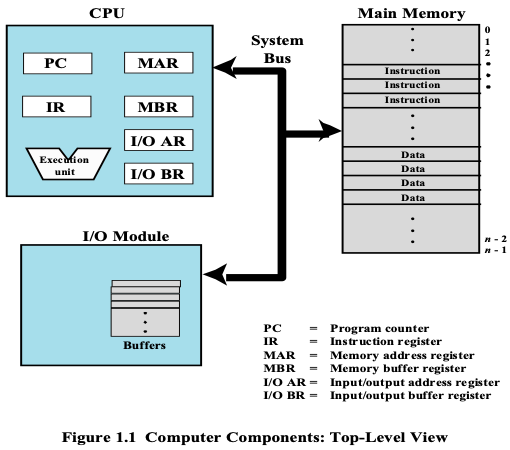

-------

## 1.2 Processor Register

* **Introduction**
  * What is Registers:
    * Memory inside CPU
  * Why Registers:
    * Enable CPU to minimize main-memory references.
  * Can be classified into:
    * **User-visible registers** 用户可见寄存器
    * **Control and status registers** 控制和状态寄存器

* **User-visible registers** 用户可见寄存器
  * How to use:
    * **May be referenced** (访问/存取) by machine / assemble language.
  * Who will use:
    * **Available to all programs**.
    * application programs / system programs

* **Control and Status Register** 控制和状态寄存器
  * How to use:
    * Are used to control the operations of the processor
  * Who will see:
    * **Most are not visible to the users**.
    * Some may be accessibly be machine instruction in control or system mode.

* **Classify**:
  * **Program Counter** (**PC**)
    * Contains the address of an instruction to be fetched.
  * **Instruction Register** (**IR**)
    * Contains the instruction most recently fetched.
  * **Program Status Word** (**PSW**)
    * Condition codes [more detail next]
    * Other state-related bits, such as:
      * Interrupt enable/disable
      * Supervisor/user mode
      * … …

---------

## 1.3 Instruction Execution

* Two stages of **each** Instruction Execution
  * Processor reads / loads / **Fetches** instructions from memory
  * Processor **Executes** each instruction
  * **Instruction Cycle**:
    * The processing required for a single instruction execution.

* **Key point**:
  * **Program Counter** (**PC**) contains the address of an instruction to be fetched.
  * **Instruction Register** (**IR**) contains the instruction most recently fetched.
  * **Program counter (PC) of CPU is incremented after each fetch.**

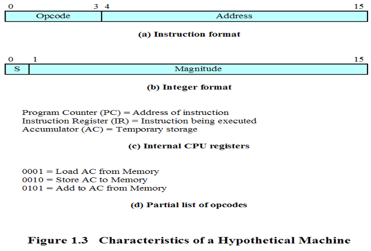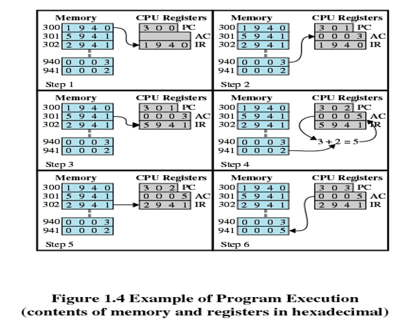

---------

## 1.4 Interrupts

#### 1.4.0 Interrupt Introduction

* **Why Interrupt in computer system?**
  * Most I/O devices are slower than the processor, so interrupt can improve CPU’s utilization (提高 CPU 利用率)
    * $i.e.$ Processor must pause to wait for device.
  * Count / Clock (计数时钟中断)
  * Avoid some program to monopolize CPU (避免 CPU 被独占)

* **Interrupt**
  * **Definition**: A mechanism by which other modules (I/O, clock) may interrupt the normal sequencing of the processor.
    * An I/O device can stop what the CPU is operating to provide some necessary service.
  * **Interrupt** and **Restore / Resume**: 中断和恢复
    * **Both software and hardware** are used to support it.

#### 1.4.1 Interrupts and the Instruction Cycle

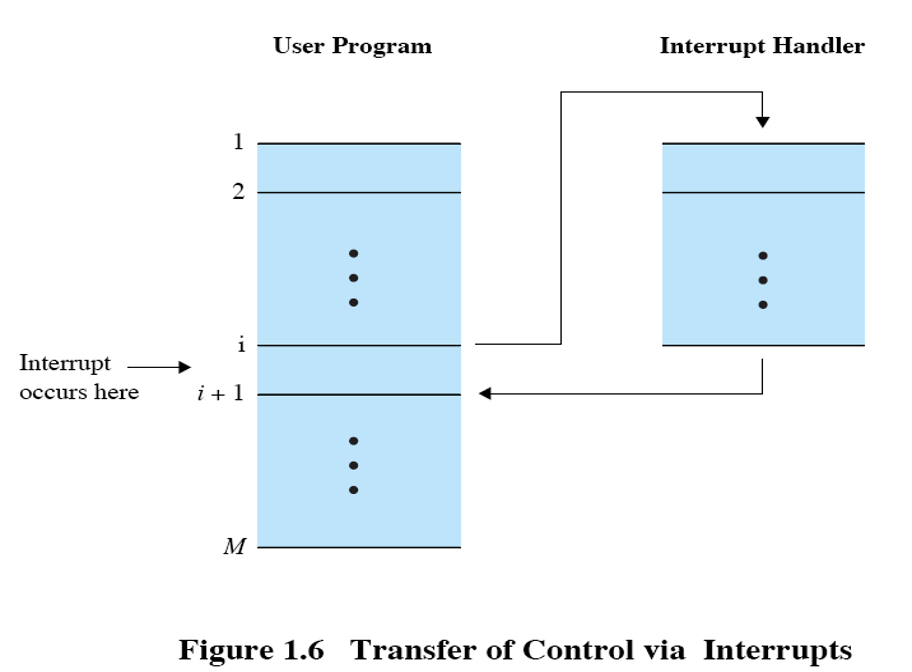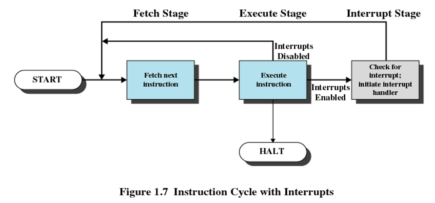

#### 1.4.2 Interrupt Processing

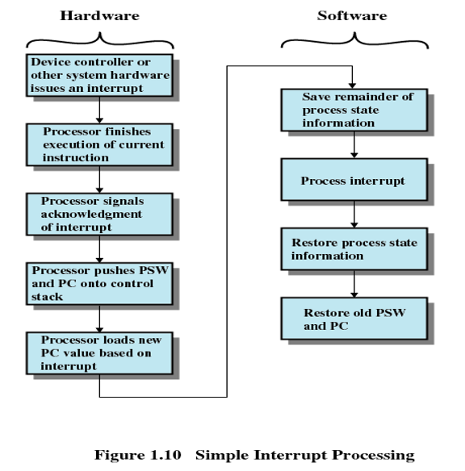

#### 1.4.3 Multiple Interrupts

* **Method 1**: **Sequential interrupt processing**  Disable interrupts while an interrupt is being processed.
* **Method 2**: **Nested interrupt processing** Define priorities for interrupts.

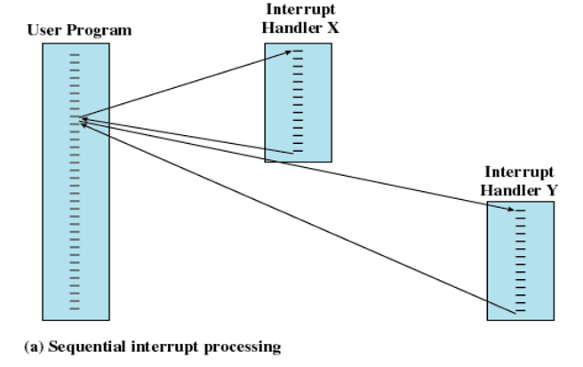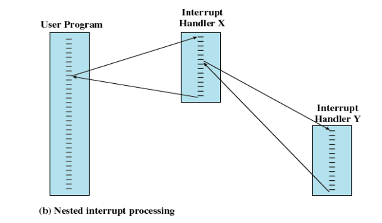

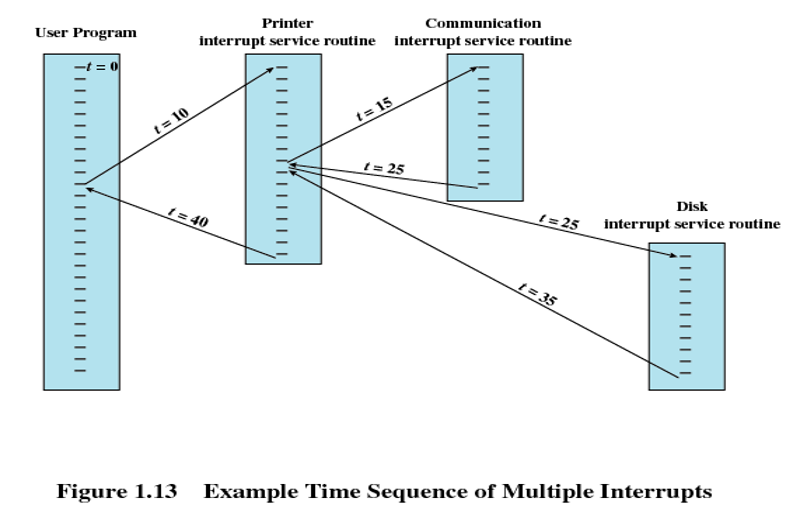

#### 1.4.4 Multiprogramming

* Multiprogramming (多道程序)
  * If the time required to complete an I/O operation is much greater than the user code between I/O calls, then the processor will be idle much of the time.
  * A solution to this problem is to allow multiple user programs to be active at the same time.

-------

## 1.5 The Memory Hierarchy

* (Speed , Price, Capacity) 的不可兼得性/矛盾:
  * Faster access time: greater cost per bit
  * Greater capacity: smaller cost per bit
  * Greater capacity: slower access speed

* **Memory Hierarchy**： 
  * **Three Levels**
    * **Level 1**：板上存储器
    * **Level 2**：板外存储器
    * **Level 3**：离线存储器
  * **Going Down the Hierarchy** 
    * Increasing capacity
    * Increasing access time   (that is slow speed)
    * Decreasing cost per bit
    * Decreasing frequency of access of the memory by the processor

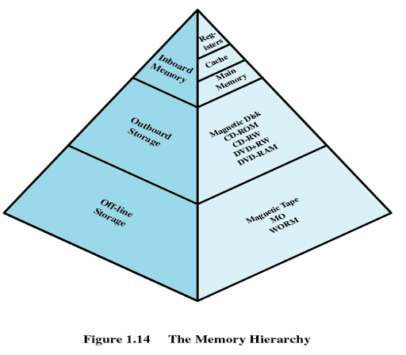

* **Obtaining larger and faster memory**:
  * **Get larger capacity**
    * Smaller, more expensive, faster memories are supplemented by larger, cheaper, slower memories
  * **Get faster speed**
    * Larger, cheaper, slower memories are cached (缓存) by Smaller, more expensive, faster memories 
  * **Locality of reference** (访问局部性/局部性原理/principle of locality)
    * Spatial locality (空间局部性)
    * Temporal locality (时间局部性)

------

## 1.6 Cache Memory

* **Exploit the principle of locality**:
  * Add something to cache between fast and slow memory

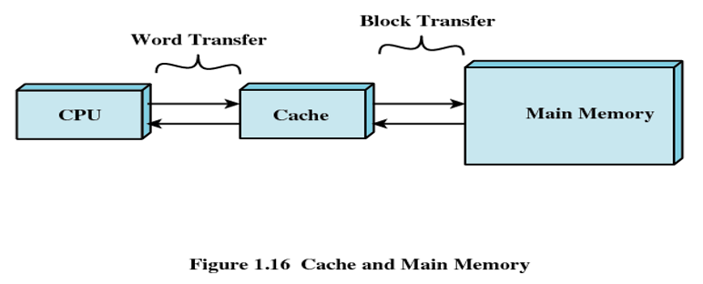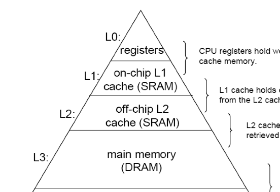

* **Cache Principles** 
  * Contains a copy of a portion of main memory
  * Processor first checks cache:
    * (Hit) If found, just use it. And do not need access to the memory
    * (Miss) If not found in cache, the block of memory containing the needed information is moved to the cache and delivered to the processor

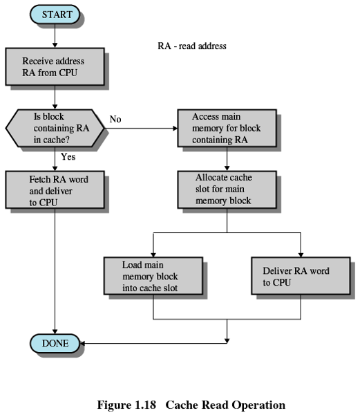

---------

## 1.7 I/O Communication Techniques

* **Three methods**:

  * Programmed I/O
  * Interrupt-Driven I/O
  * Direct Memory Access / DMA

* **Method1: Programmed I/O** (可编程I/O)

  * I/O module performs the action, not the processor
  * I/O module sets appropriate bits in the I/O status register
  * Processor checks status until operation is complete
  * **Disadvantage**: It is a time-consuming process that keeps the processor busy needlessly.

* **Method2: Interrupt-Driven I/O** 

  * Processor is interrupted when I/O module ready to exchange data
  * Processor saves context of program executing and begins executing interrupt-handler
  * **Advantage**: No needless waiting, so more efficient than programmed I/O
  * **Disadvantage**: Still consumes a lot of processor time, because every word read or written passes through the processor.

* **Method3: Direct Memory Access** 

  * Transfers a block of data directly to or from memory, I/O exchanges occur directly with memory
    * Processor grants I/O module authority to read from or write to memory
    * Processor continues with other work
    * An interrupt is sent when the transfer is complete

  * **Advantage** the processor responsibility for the exchange 

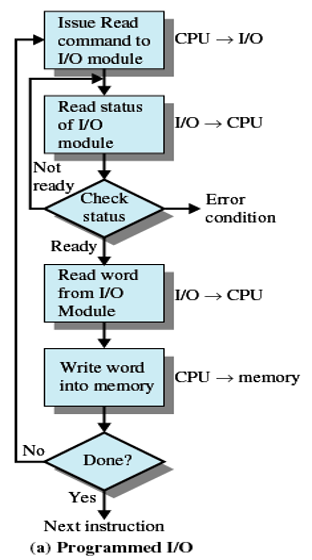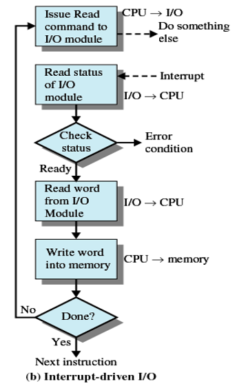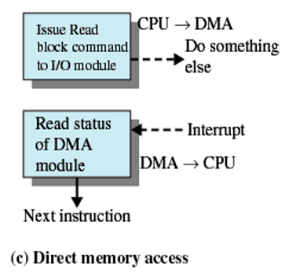