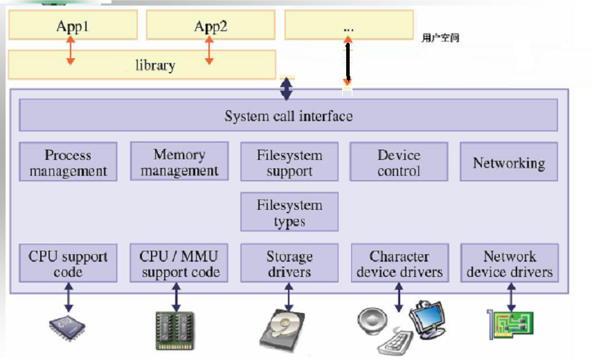
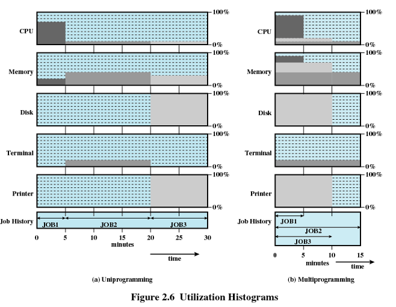
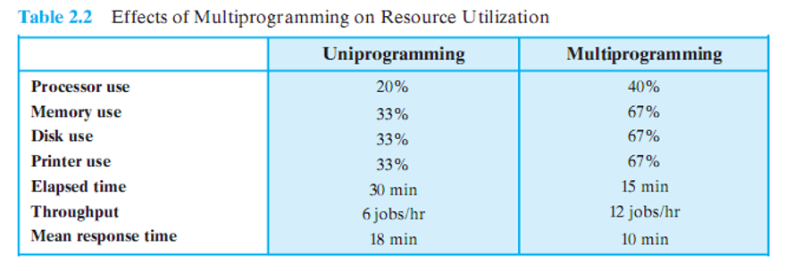
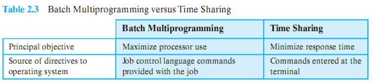
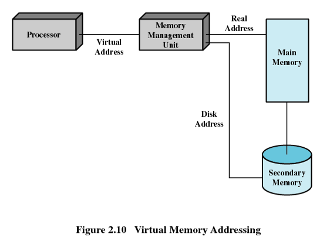
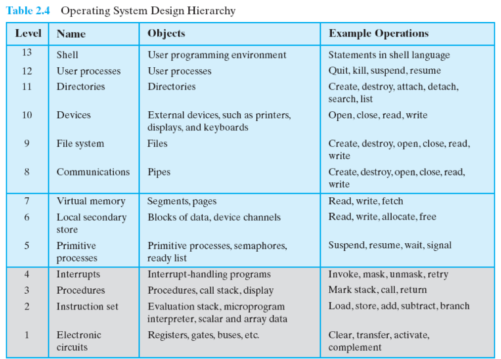

# Chapter02

2023.09.14 / 2023.09.21

教授：熊运余

[TOC]

# $\S$2. Operating System Overview

* **2.1 Operating System Objectives and Functions**
* **2.2 The Evolution of Operating Systems**
* **2.3 Major Achievements**
* **2.4 Developments Leading to Modern Operating Systems**
* **2.5 Load of APP & OS**
* **2.6 Other topic**

----------------

## 2.1 OS Objectives and Functions

* **2.1.0 Introduction**
* **2.1.1 Operating System as a User/Computer interface**
* **2.1.2 Operating System as a Resource Manager**
* **2.1.3 Ease of Evolution of an Operating System**

---------

#### 2.1.0 Introduction

* **Operating System definition**: A program that …
  * Controls the execution of application programs.
  * Acts as an interface between applications and hardware.

* **Operating System Objectives** 
  * **As User/Computer Interface** —— Convenience / 方便
    * Makes the computer more convinient to use.
  * **As Resource Manager** —— Efficiency / 有效可靠
    * Allows computer system resources to be used in efficient manner.
  * **As System Software** —— Ability to evolve / 扩展
    * Permit effective development, testing and introduction of new system functions without interfering with services.

#### 2.1.1 Operating System as a User/Computer interface

#### 2.1.2 Operating System as a Resource Manager

* **Operating System as Resource Manager**

  * Responsible for managing resources / hardware.
  * Work in the same way as ordinary computer software.
    * It is program that is executed

  * Frequently relinquishes (放弃) and regains control of the processor

* **Kernel** (内核)
  * Portion of operating system that is in main memory
  * Contains most frequently used functions
  * Also called the nucleus (核子)
* **Shell** (外壳)
  * **CLI**: command line interface
  * **GUI**: graphical user interface

#### 2.1.3 Ease of Evolution of an Operating System

* **Why?**
  * hardware upgrades + new types of hardware
  * new services
  * to fix bug
* **How?**
  * Modularizaion
  * OS Architecture

-----------

## 2.2 The Evolution of Operating Systems

* **2.2.1 Serial Processing: No Operating Systems**
* **2.2.2 Simple Batch Systems**
* **2.2.3 Multiprogrammed Batch Systems**
* **2.2.4 Time-Sharing Systems**

--------

#### 2.2.1 Serial Processing: No Operating Systems

* **命名**: user have access to the system in series
* **特点**: programmer interacted directly with the computer hardware 
* **操作**: Machines run from a console with display lights, toggle switches (拨码开关), input device, and printer
* **Problem**
  * **Scheduling**: Most installations used a hardcopy sign-up sheet to reserve computer time
  * **Setup time**: included loading the compiler, source program, saving compiled program, and loading and linking

#### 2.2.2 Simple Batch Systems

* **Central idea**:  
  * **Batch**: made up by many jobs from users (批)
    * A job may use several program
    
  * The use of a piece of software known as the **monitor**, that controls the sequence of events.
  
* **Process**:
  * The monitor reads a job from the batch 
  * Then control is passed to this job
  * When the job is completed, it returns control to the monitor
  * The monitor reads in the next job

* **Job Control Language** (JCL) 
  * Special type of programming language
  * Provides instruction to the monitor
  * What compiler to use
  * What data to use
  * …….

* **CPU mode** 
  * **User program executes in user mode** (用户模式)
    * Certain instructions may not be executed
    * Some memory can not be accessed

  * **Monitor executes in system mode** (系统模式)
    * Kernel mode (内核模式)
    * Privileged instructions are executed
    * Protected areas of memory may be accessed

* **Hardware Features**
  * **Memory protection**
    * Do not allow the memory area containing the monitor to be altered
  * **Timer**
    * Prevents a job from monopolizing (独占) the system
  * **Privileged instructions**
    * Certain machine level instructions can only be executed by the monitor
  * **Interrupts**
    * This feature gives the OS more flexibility in relinquishing (放弃) control to and regaining control from user programs

#### 2.2.3 Multiprogrammed Batch Systems

* **Central idea**:
  * Multiple jobs in memory at a time

* **Classify**:
  * **Uniprogramming**:
    * Processor must wait for I/O instruction to complete before preceding
  * **Multiprogramming**:
    * When one job needs to wait for I/O, the processor can switch to the other job
    * Also known as **Mutitasking**.

#### 2.2.4 Time-Sharing Systems

* **Central idea**:
  * Processor’s time is shared among **multiple users/jobs**
    * Time slicing 时间片 (技术)
  * Why?
    * Multiple users simultaneously access the system (mainframe computer 大型主机) **through terminals **
    * **Requirement**: handle **multiple interactive users/jobs**

---------

## 2.3 Major Achievements

#### 2.3.1 Processes 进程

* **Components** 

  * An executable program / **code**

  * Associated **data** needed by the program

  * Execution **context** of the program (the core)

    All information the operating system needs to manage the process

* The process is realized/implemented as a **data structure** 

  * All information the operating system needs to manage the process is stored in the data structure

#### 2.3.2Memory Management 内存管理

* **Five responsibilities**:
  * Process isolation (进程隔离)
  * Automatic allocation and management (自动分配和管理)
  * Support of modular programming (模块化程序设计)
  * Protection and access control (保护与存取控制)
  * Long-term storage (长期存储 文件管理系统)
* **Virtual Memory** / VM
  * Allows programmers to address memory from a logical point of view 允许局部加载
  * No hiatus (脱节) between the execution of successive processes, while one process was written out to secondary store and the successor process was read in
* **Page** 页
  * Allows process to be comprised of a number of fixed-size blocks, called pages.
  * Each page may be located any where in main memory.
* **Virtual Memory Addressing**
  * Storage system consists of **main memory** and **auxiliary (辅助) memory**

#### 2.3.3 Information Protection and Security

* Availability 不被中断
* Confidentiality 保密性 授权访问
* Data integrity 不被未授权篡改
* Authenticity 认证

#### 2.3.4 Scheduling and Resource Management

* Manage the resources (such as CPU, Main Memory, I/O devices)

* Schedule (调度) these resources to various active processes (进程)

* **Factors to be considered**:

  * **Fairness** (公平性)

    Give equal and fair access to resources

  * **Differential responsiveness** (有差别的响应性)

    Discriminate (区别) among different classes of processes

  * **Efficiency** (高效性)

    Maximize throughput(吞吐量), minimize response time(响应时间), and accommodate as many users as possible

#### 2.3.5 System Structure

* The size and complexity of operating systems has grown. 

* **All-too-common problems**

  * Chronically late (习惯性落后) in being delivered
  * Performance is often not what was unexpected
  * Latent (潜在的) bugs
  * Vulnerable of security attacks

* **Solution**：

  * The software must be modular and modules must have well-defined interfaces

  * Levels

----------

## 2.4 Developments Leading to Modern Operating Systems

* **Background**

  * new developments in hardware
  * new applications
  * new security threats

* **Five features** are mentioned in this chapter

  * **1. Microkernel architecture** 微内核 (more on chapter 04)

    * VS **monolithic kernel(单体内核) architecture**

    * Assigns only a few essential functions to the kernel

      1) Address spaces 地址空间

      2) Interprocess communication (IPC) 进程间通信

      3) Basic scheduling 基础调度

    * 对比OS的单内核完成所有管理工作，它只含基本功能

  * **2. Multithreading** 多线程 (more on chapter 04)

    * Process is divided into threads that can run concurrently

    * **Thread** 线程

      1. Dispatchable unit of work

      2. Executes sequentially and is interruptable

    * Process is a collection of one or more threads and other resources

    * 进程含多线程，资源占用少

  * **3. Symmetric multiprocessing** (SMP) 对称多处理 (more on chapter 04)

    * 一般具有multiple processors，且完全相同对等
    * 性能提升 对抗处理器失效 配置灵活

  * **4. Distributed operating systems** 分布式操作系统 (more on chapter 14~15)

    * 网络一组独立计算机虚拟为用户的一台完整计算机

  * **5. Object-oriented design**

