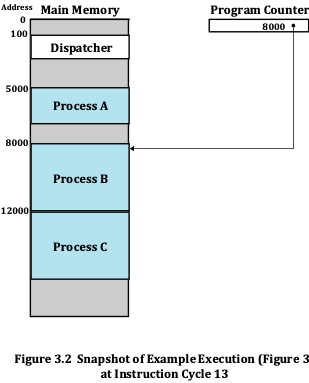
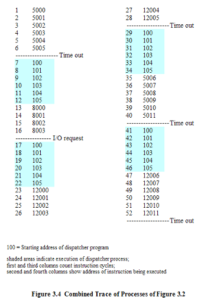
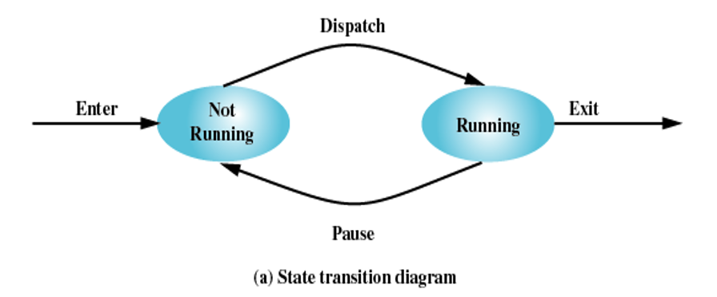
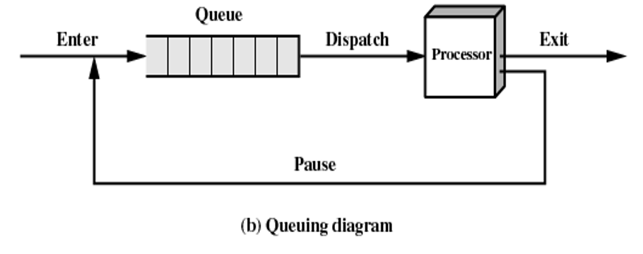
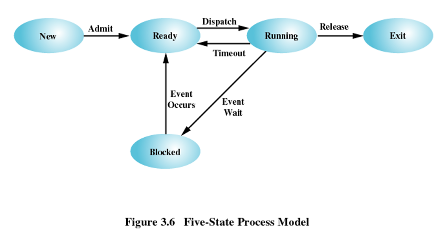
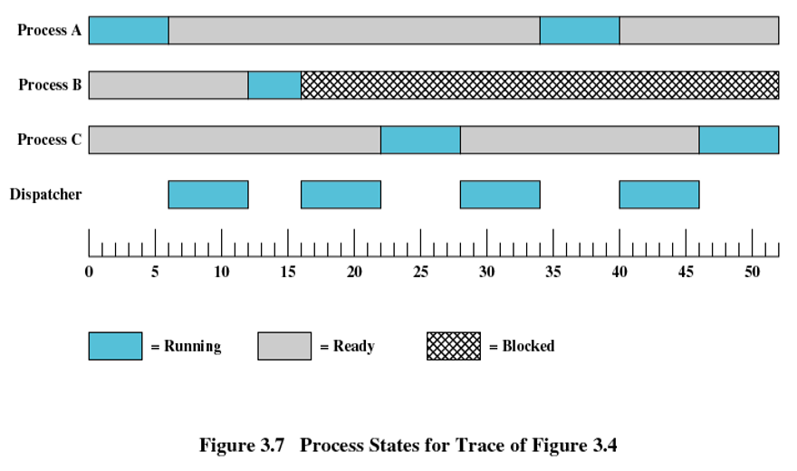
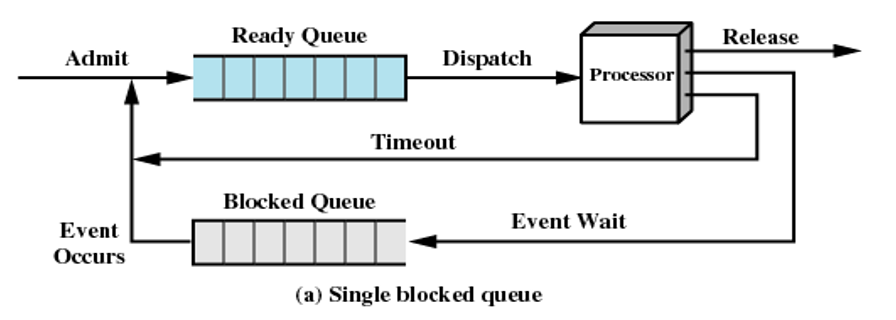
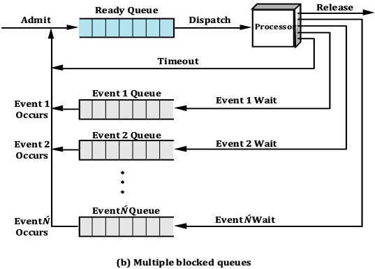
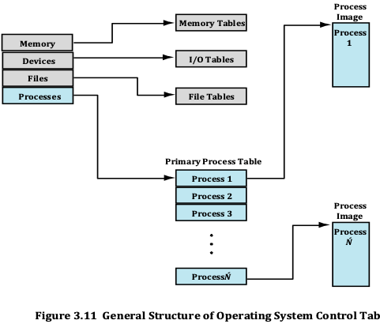
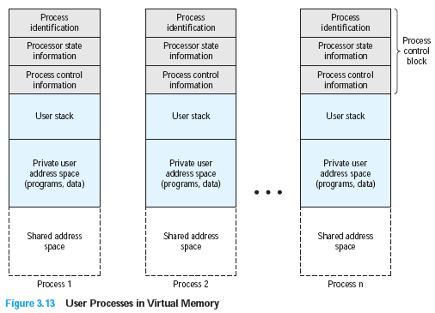

# Chapter03

2023.09.21 / 2023.09.28

教授：熊运余

[TOC]

# $\S$3. Process Description and Control

* **3.1 What is a Process**

* **3.2 Process States**

* **3.3 Process Description** 

* **3.4 Process Control**

* **3.5 Execution of the Operating System**

* **3.6 process API introduction**

-------

## 3.1 What is a Process

* **Process**

  * **Def**: 

    * **A program in execution**

    * An **instance of a program** running on a computer

    * The entity that can be **assigned to and executed on a processor**

    * **A unit of activity characterized by**：

       ① the execution of a sequence of instructions

       ② a current state
  
       ③ an associated set of system resources
  
* **Process Control Block** (PCB)

  * Contains the process elements
  * Created and manage by the operating system
  * Allows support for multiple processes进程派生进程，父子进程关系

-----------

## 3.2 Process Stats

* **3.2.1 Trace of the Process**
* **3.2.2 A Two-State Process Model of Process** 
* **3.2.3 The Creation and Temination** 
* **3.2.4 A Five-State Model**
* **3.2.5 Suspended Process**

----------

#### 3.2.1 Trace of the Process

* **Trace of Process** (进程轨迹) 
  * Sequence of instruction that execute for a process
  * Dispatcher (调度器) switches the processor from one process to another

 

#### 3.2.2 A Two-State Process Model

* Process may be in one of two states

  * Running
  * Not-running

#### 3.2.3 The Creation and Temination

#### 3.2.4 A Five-State Model

* **A Five-State Model**
  * Running (运行态)
  * Ready (就绪态)
  * Blocked (阻塞态)
  * New (新建态)
  * Exit (退出态)

* **Using blocked queues**

#### 3.2.5 Suspended Process

* **Why it?**

  * Processor is faster than I/O so all processes could be waiting for I/O

  * Swap these processes to disk to free up more memory

* Blocked state becomes suspend state when swapped to disk

  * **Two new states**
    * Blocked / Suspend
    * Ready / Suspend

-----------

## 3.3 Process Description

* 3.3.1 Process and Resources
* 3.3.2 Operating System Control Structures
* 3.3.3 Process Control Structures

----------

#### 3.3.1Process and Resources

#### 3.3.2 Operating System Control Structures

* 即：OS掌握进程哪些信息，怎么存储这些信息
* Information about the current status of each process and resource (每个进程和资源的当前状态)
* Tables are constructed for manage 4 kinds of resources (操作系统构造并维护他所管理的四类资源实体的信息表)
  * MEM, I/O, FILE, PROCESS
  * Tables are linked or cross-referenced这些表交叉引用

* **Memory Tables**
  * Allocation of main memory to processes (分配给进程的主存)
  * Allocation of secondary memory to processes (分配给进程的辅存)
  * Protection attributes for access to shared memory regions (共享内存区域的保护属性)
  * Information needed to manage virtual memory (虚拟内存的管理信息)
* **I/O Tables**
  * I/O device is available or assigned(分配状态)
  * Status of I/O operation 
  * Location in main memory being used as the source or destination of the I/O transfer (数据传送的源和目的地址)
* **File Tables**
  * Existence of files
  * Location on secondary memory
  * Current Status
  * Attributes

#### 3.3.3 Process Control Structures

* 即：进程记录哪些信息便于运行和管理
* **Process image** 进程映像
  * The collection of program, data, stack, and attributes(PCB): not contiguous in addresses

* **Process Control Block**
  * **Process Identification**
  * **Processor State Information**
    * User-Visible Registers
    * Control and Status Registers
    * Stack Pointers
  * **Process Control information**
    * Scheduling and State Information
    * Data Structuring (link information)
    * Interprocess Communication
    * Process Privileges
    * Memory Management
    * Resource Ownership and Utilization

--------

## 3.4 Process Control

* **3.4.1 Modes of Execution**
* **3.4.2 Process Creation**
* **3.4.3 Process Switching**
* **3.4.4 Execution of the Operating System**

-------

#### 3.4.1 Modes of Execution

* **User mode**
  * Less-privileged mode
  * User programs typically execute in this mode
* **System mode**, **control mode**, or **kernel mode**
* More-privileged modeKernel of the operating systemTranslation between the two model
* Processor status register (psr) and current privileged level (cpl
* User mode >System mode
  System mode >User mode

#### 3.4.2 Process Creation

#### 3.4.3 Process Switching

#### 3.4.4 Execution of the Operating System
