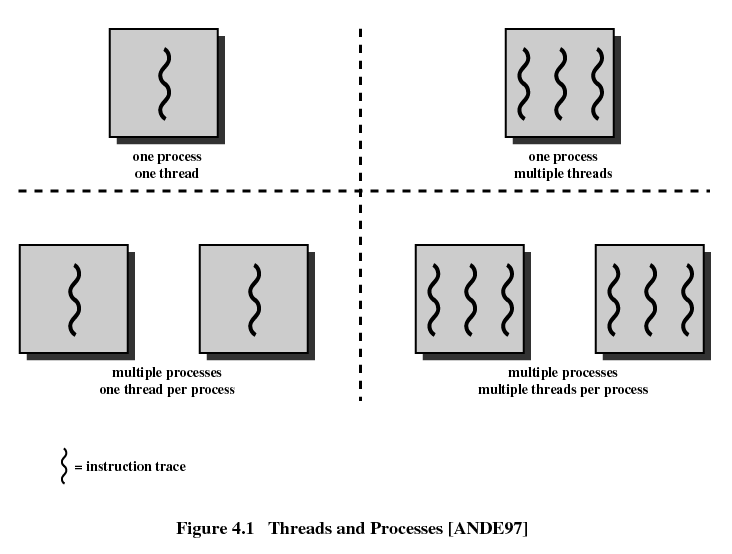
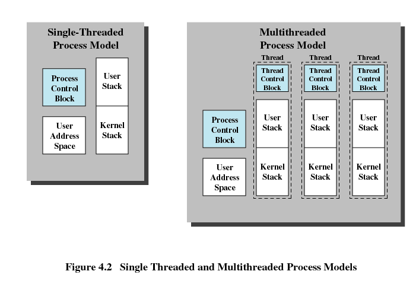
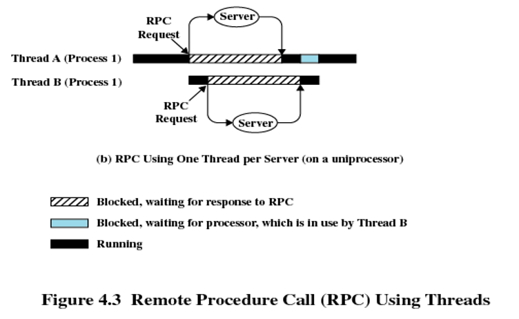
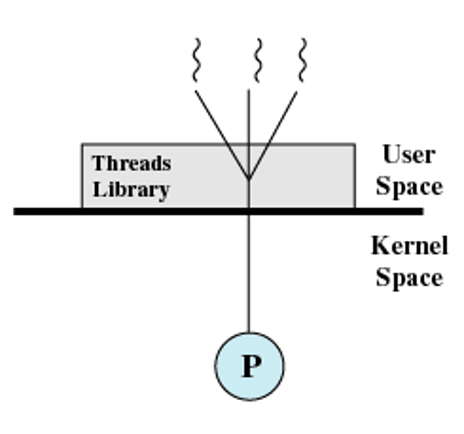
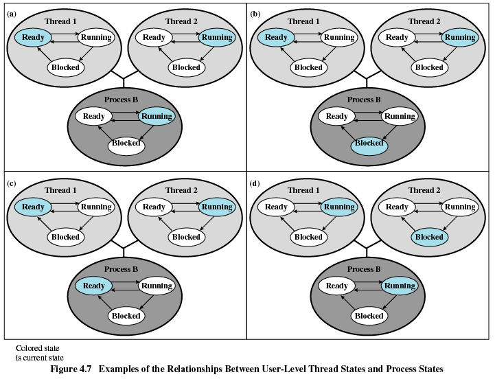
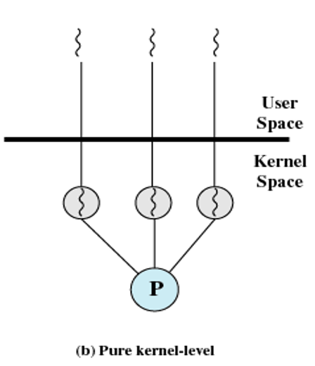

# $\S$4. Threads, SMP, and Microkernels

2023.10.07

教授：熊运余

[TOC]

----------

-----

## 4.1 Process and threads

* **4.1.1 Introduction**
* **4.1.2 Multithreading**
* **4.1.3 Thread Functionality**
* **4.1.4 User-Level and Kernel-Level Thread**
* **4.1.5 Other Arrangements**

-------

### 4.1.1 Introduction

* **Two characteristics**

  * **Resource ownership** (资源所有权)
    * process includes a virtualaddress space to hold the process image

  * **Scheduling / execution** (调度/执行)
    * follows an execution path thatmay be interleaved with other processes

  * **These two characteristics are treated independently by the operating system**

* **Scheduling / execution**
  * Dispatching is referred to as a **thread** or **lightweight process** (调度的单位称为线程或轻量进程)

* **Resource**
  * Resource of ownership is referred to as a **process** or **task** (资源所有权的单位称为进程或者任务)

-------

### 4.1.2 Multithreading

* **Single-Thread** (单线程)

  * Single-threaded approach refers to the traditional approach of asingle thread of execution per process, in which the concept of athrcad is not recognized

    (单线程指一个进程中只有一个线程在执行的传统方法，线程的概念并不明确)

    * MS-DOS supports a single thread(单进程、单线程)
    * Some UNIX supports multiple user processes but only supports onethread per process (多进程，每个进程单线程)

* **Multithreading** (多线程)

  * Multithreading refers to the ability of an OS to support multiplethreads of execution within a single process(指操作系统支持在个进程中执行多个线程的能力)
    Windows, Solaris, Linux, Mach, and OS/2 support multiple threads

* **Process** — Unit of Resource allocation and Unit of Process Protection (资源分配和保护的单位)

  * Have a virtual address space (虚拟地址空间) which holds theprocess image ( code, data, stack and PCB)
  * Protected access to processors, memory,other processes (与其他进程通信), files, and I/O resources
  * Contains one or more threads

* **Thread** — Unit of Scheduling/Execution(调度执行的单位)

  * Each thread has:

    * An execution state (running, ready, etc.

    * Saved thread context when not running

    * Has an execution stack

    * Some per-thread static storage for local variables 局部变量存储空间

    * Access to the memory and resources of its process

      — all threads of a process share this

* **Benefits of Threads**
  1. Takes less time to create a new thread than a process (创建快)
  2. Less time to terminate a thread than a process (结束快)
  3. Less time to switch between two threads within the sameprocess (切换快)
  4. Since threads within the same process share memory and filesthey can communicate with each other without invoking thekernel (通信快)
* **Threads are Affected by Many Process Action**
  * **Suspending** a process involves suspending all threads of the process since all threads share the same address space (挂起进程会挂起该进程的所有线程)
  * **Termination** of a process, terminates all threads within the process (终止进程会终止该进程的所有线程)

### 4.1.3 Thread Functionality

* **Key states for a thread** 
  * Running, Ready, Blocked.
* **Operations associated with a change in thread state**
  * **Spawn** (派生)
    * Spawn another thread
  * **Block** (阻塞)
  * **Unblock** (解除阻塞)
  * **Finish**
    * Deallocate register context and stacks

* **THREAD Synchronization** 线程同步

  * **Why?**

    * In a process:

      All threads share the same address space and other resources (open files). 

      Any alteration of a resource by one thread affects the others.

### 4.1.4 User-Level and Kernel-Level Thread

* **User-Level Threads** (ULT，用户级线程)

  * Multithread implemented by a threads library (线程库)

  * All thread management is done by the application

  * The kernel is not aware of the existence of threads & scheduling is done on a process basis

* **Kernel-Level Threads** (KLT, 内核级线程)
  * Kernel maintains context information for the process and the threads
  * Scheduling is done on a thread basis

* **Advantages of ULT to KLT**

  * Less overhead of thread switches (mode switches do not required) 

    （切换开销小）

  * Scheduling can be application specific 

    （调度策略根据应用可以不同）

  * ULTs can run on any operating system without modify the underlying kernel 

    （无需底层内核修改）

* **Disadvantages of ULT to KLT**

  * One thread is blocked, all other threads of the process are blocked 

    （ULT按进程调度）

  * A multithreaded application cannot take advantage of multiprocessing 

    （线程不能分配到多核）

  * Ways to work around these drawbacks:

    * Multiple processes 用多进程代替多线程
    * Jacketing 套管 针对阻塞问题

* **Advantages of KLT to ULT**

  * Overcomes the two principal drawbacks of the ULT

    * Multiple threads in one process can simultaneously run on multiple processors 

      （多CPU执行）

    * One threads blocked cannot make the other threads within the same process blocked 

      （仅阻塞单个线程）

* **Disadvantages of KLT to ULT**

  * The principal disadvantage is that thread switch requires mode switches(模式切换) to the kernel

* **Combined Approaches** 混合方式

  * thread creation/scheduling/synchronization is done completely in user space 

    （分配调度同步可以在用户空间）

  * The multiple ULTs from a single application are mapped onto some (smaller or equal) number (adjustable) of KLTs. 

    （允许映射到内核）

* **Advantages of Combined Approaches**

  * multiple threads within the same application run
    * in parallel on multiple processors （多cpu运行）
    * A blocking system call only blocks the thread. （仅阻塞单个线程）

### 4.1.5 Other Arrangements