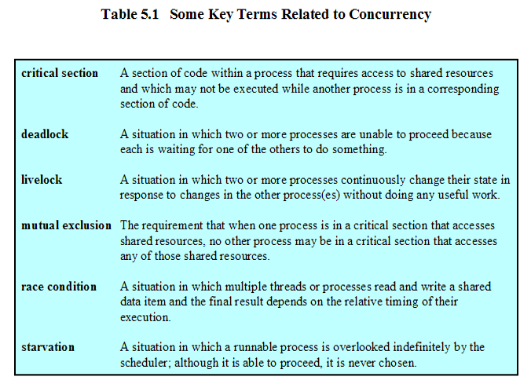

# $\S$5. Mutual Exclusion and Synchronization

[TOC]

--------

## 5.1 Principles of Concurrency 并发

* **5.1.1 A Simple Example of Concurrency**
* **5.1.2 Race Condition**
* **5.1.3 Different Concerns**
* **5.1.4 Requirements for Mutual Exclusion**

-----------

* **Concepts**
  * Critical Section 临界区
  * Deadlock 死锁
  * Livelock 活锁
  * Mutual Exclusion 互锁
  * Race Condition 竞争条件
  * Starvation 饥饿

* **Concurrency** 并发 

  * Concurrency arises in three different contexts:

    * **Multiple applications** (多应用程序)

      Multiprogramming

    * **Structured application** (结构化应用程序)

      Some application can be designed as a set of concurrent processes

    * **Operating-system structure** (操作系统结构)

      Operating system is a set of processes or threads

* **Difficulties of Concurrency**

  * Sharing of global resources
  * Operating system managing the allocation of resources optimally
  * Difficult to locate programming errors

## 5.2 Mutual Exclusion: Hardware Support

## 5.3 Semaphores 信号量

## 5.4 Monitors

## 5.5 Message Passing

## 5.6 Readers/Writers Problem

## 5.7 Summary