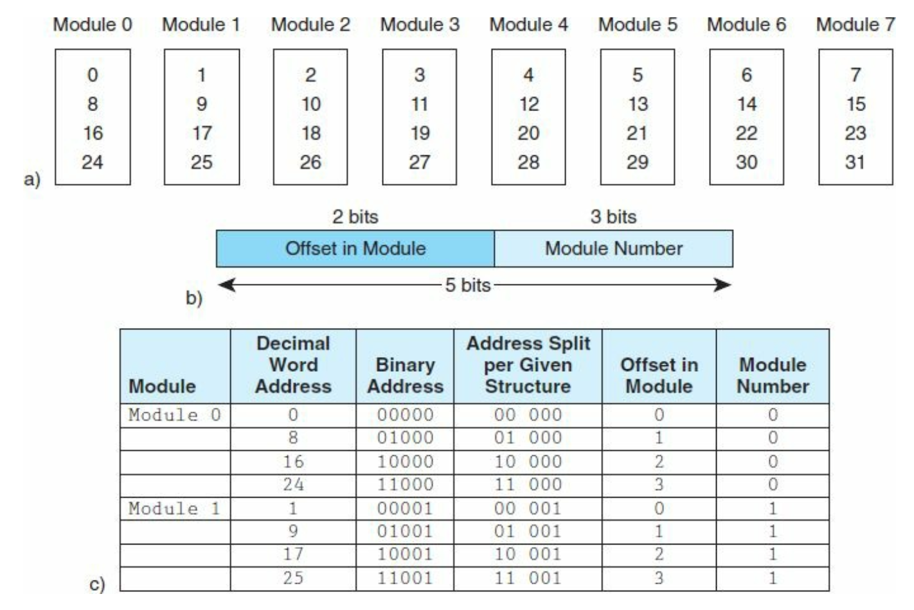
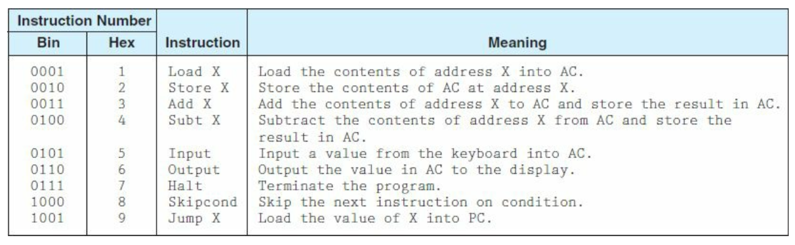
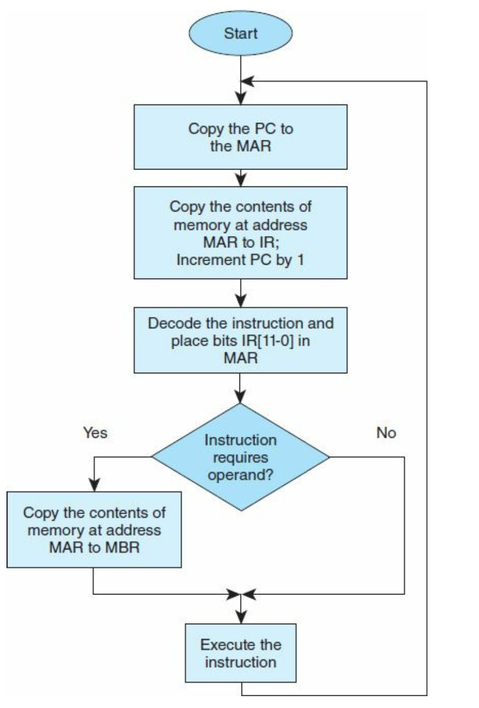
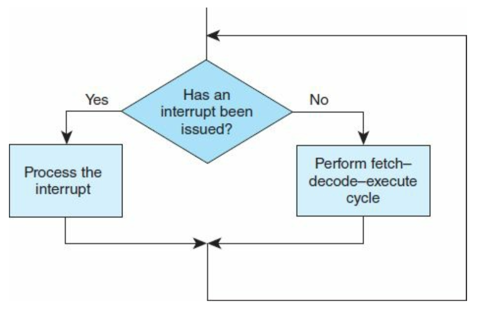
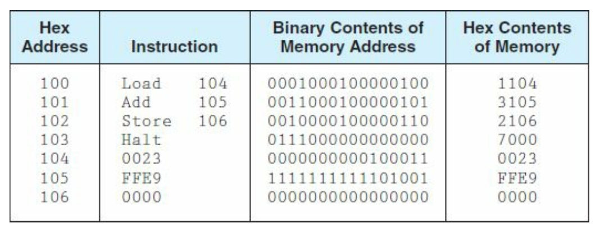
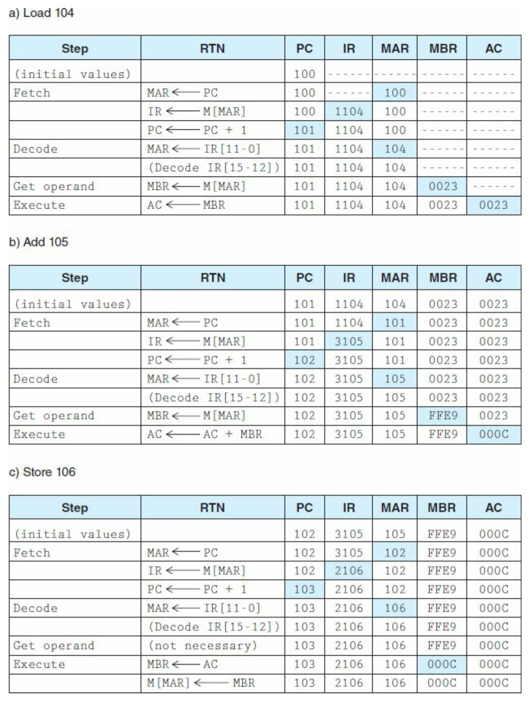
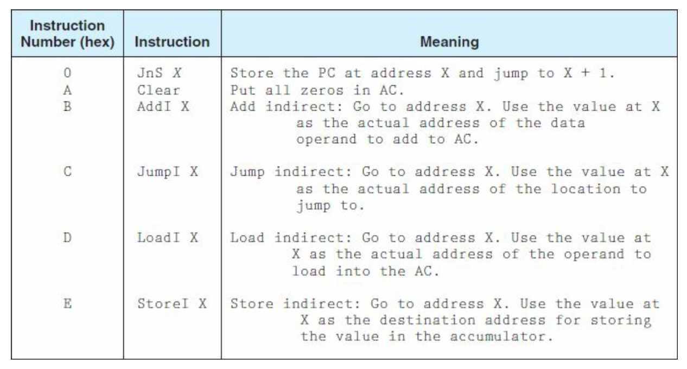
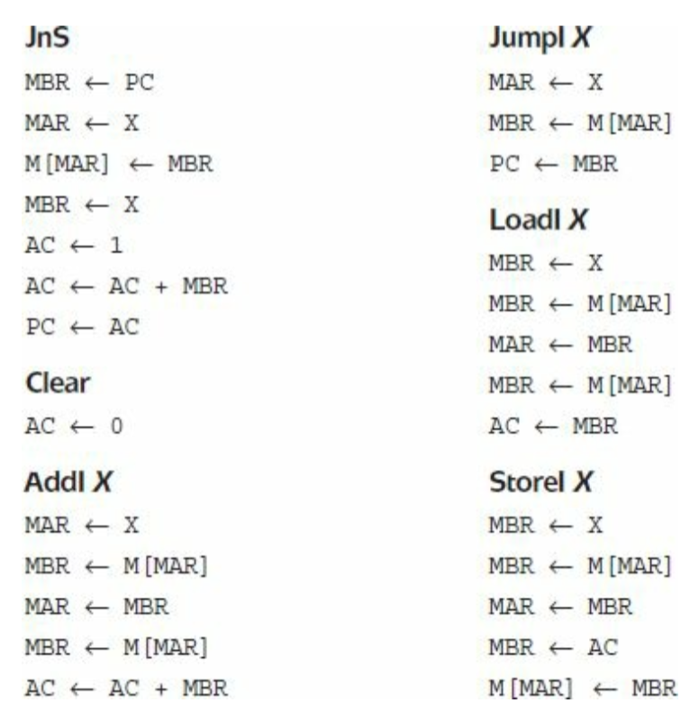

# Lec 03

教授：袁学东

2023/09/18

# Review

* **The von Neumann Model**
  * **Three hardware systems**:
    * A central processing unit (CPU) 
    * A main memory system
    * An I/O system
  * The capacity to carry out sequential instruction processing.
  * A **single data path** between the CPU and main memory. 
    * This single path is known as *the von Neumann bottleneck*.

# $\S$4. MARIE: An Introduction to a Simple Computer

## 4.1 Introduction

## 4.2 CPU Basics

* The computer’s CPU fetches, decodes, and executes program instructions.
* The two principal parts of the CPU are the *datapath* and the *control unit*.
  * The datapath consists of an arithmetic-logic unit and storage units (registers) that are interconnected by a data bus that is also connected to main memory.
  * Various CPU components perform sequenced operations according to signals provided by its control unit.

## 4.3 The Bus

* **Bus components**
  * Buses consist of data lines, control lines, and address lines.
  * While the data lines convey bits from one device to another, control lines determine the direction of data flow, and when each device can access the bus.
  * Address lines determine the location of the source or destination of the data.

* **Bus arbitration** (仲裁)

  * In systems with more than one master device, **bus arbitration** is required. 

  * Bus arbitration schemes must provide priority to certain master devices and, at the same time, make sure lower priority devices are not starved out.

  * **Four catagories**:

    **(1) Daisy chain arbitration**

    * This scheme uses a “grant bus” control line that is passed down the bus from the highest priority device to the lowest priority device.
    * Fairness is not ensured, and it is possible that low- priority devices are “starved out” and never allowed to use the bus.

    **(2) Centralized parallel arbitration**

    * Each device has a request control line to the bus and a **centralized arbiter** selects who gets the bus.

    **(3) Distributed arbitration using self-selection**

    * This scheme is similar to centralized arbitration but instead of a central authority selecting who gets the bus, **the devices themselves** determine who has highest priority and who should get the bus.

    **(4) Distributed arbitration using collision detection**

    * Each device is allowed to make a request for the bus. If the bus detects any **collisions** (multiple simultaneous requests), the device must make another request.

## 4.4 Clocks

* **Clock**:

  * Every computer contains an internal clock that **regulates how quickly instructions can be executed**.

  * The clock also synchronizes all of the components in the system. As the clock ticks, it sets the pace for everythingthat happens in the system.

  * Instruction performance is often measured in **clock cycles**—the time between clock ticks —instead of seconds.
  * **Formula**:
    * $\rm{CPU\ time = \frac{seconds}{program} \times \frac{average\ cycles}{instruction} \times \frac{seconds}{cycle}}\\$

## 4.5 The Input/Output Subsystem

* **Input and output (I/O) devices**:

  * **Input and output** (**I/O**) **devices** allow us to communicate with the computer system.

  * I/O is the transfer of data between primary memory and various I/O peripherals.

  * Performed in two ways:

    **(1) Memory-mapped I/O**

    * The registers in the interface appear in the computer’s memory map, and there is no real difference between accessing memory and accessing an I/O device.

    **(2) instruction-based I/O**

    * The CPU has specialized instructions that perform the input and output.

## 4.6 Memory Organization and Addressing

* **Memory location**
  * Each register (more commonly referred to as a **memory location**) has a **unique** address.
  * Memory addresses usually start at zero and progress upward.
* **Address**
  * An address is typically represented by an unsigned integer.
  * **Byte addressable**:
    * Each individual byte has a unique address.
    * most current machines are byte addressable (even though they have 32-bit or larger words).
  * **Word addressable**:
    *  Each word (not necessarily each byte) has its own address.
* **Memory Alignment**
  * 

* **Memory interleaving**

  * **Definition**: Splits memory across multiple memory modules (or banks), in which multiple banks can be accessed simultaneously.

  * **Catagory**:

    * **High-order interleaving**: The high-order bits of the address are used.

      * Array elements are sequential.

      

    * **Low-order interleaving**: The low-order bits of the address are used to select the bank.

      * Array elements are not sequential. (每个Module 中的Element 并不连续，理论上写入更快)
      * We can access the array elements in parallel because each array element is in a different module.

      

## 4.7 Interrupts

* **Interrupts**
  * Events that alter (or interrupt) the normal flow of execution in the system.
  * **Trigger**:
    * I/O requests
    * Arithmetic errors (e.g. division by 0)
    * Arithmetic underflow or overflow
    * Invalid instructions (usually resulting from pointer issues)
    * …
  * **Category**:
    * **maskable**: can be disabled or ignored.
    * **nonmaskable**: a high-priority interrupt that cannot be disabled and must be acknowledged

## MARIE

* MARIE (**M**achine **A**rchitecture that is **R**eally **I**ntuitive and **E**asy), is a simple architecture consisting of **memory** and a **CPU**.

#### 4.8.1 Architecture

* **Components**
* Binary, 2’s complement
  * Stored program, fixed word length
* Word (but not byte) addressable
  * 4K words of main memory (this implies 12 bits per address) 
* 16-bit data (words have 16 bits)
  * 16-bit instructions: 4 for the opcode and 12 for the address
* **Seven registers** =>

#### 4.8.2 Registers and Buses

* => **Seven registers**:

  * Accumulator, AC 

    A 16-bit register that holds a conditional operator (e.g., "less than") or one operand of a two-operand instruction.

  * Memory address register, MAR

    A 12-bit register that holds the memory address of an instruction or the operand of an instruction.

  * Memory buffer register, MBR

    A 16-bit register that holds the data after its retrieval from, or before its placement in memory.

  * Program counter, PC

    A 12-bit register that holds the address of the next program instruction to be executed.

  * Instruction register, IR

    Which holds an instruction immediately preceding its execution.

  * Input register, InREG

    An 8-bit register that holds data read from an input device.

  * Output register, OutREG

    An 8-bit register, that holds data that is ready for the output device.

#### 4.8.3 Instruction Set Architecture

* **Instruction Set Architecture** (ISA)
  * An ISA specifies the format of its instructions and the primitive operations that the machine can perform.
  * The ISA is an interface between a computer’s hardware and software.
  * Some ISAs include hundreds of different instructions for processing data and controlling program execution.
  * The MARIE ISA consists of only thirteen instructions.
* **MARIE instruction format**:

* **Fundamental MARIE instructions**:

#### 4.8.4 Register Transfer Notation

* **Microoperations**

  * Each of our instructions actually consists of a sequence of smaller instructions called **microoperations**.
  * The exact sequence of microoperations that are carried out by an instruction can be specified using **register transfer language** (RTL).

* **Register Transfer Language** (RTL)

  * In the MARIE RTL, we use the notation $M[X]$ to indicate the actual data value stored in memory location $X$, and $\leftarrow$ to indicate the transfer of bytes to a register or memory location.

  * RTL for the $LOAD$ instruction:
    $$
    \begin{aligned}
    	& \rm{MAR\ \leftarrow\ X}\\
    	& \rm{MBR\ \leftarrow\ M[MAR]}\\	
    	& \rm{AC\ \leftarrow\ MBR}
    \end{aligned}
    $$

  * RTL for the $ADD$ instruction:
    $$
    \begin{aligned}
    	& \rm{MAR\ \leftarrow\ X}\\
    	& \rm{MBR\ \leftarrow\ M[MAR]}\\	
    	& \rm{AC\ \leftarrow\ AC + MBR}
    \end{aligned}
    $$

  * RTL for the $SKIPCOND$ instruction:
    $$
    \begin{aligned}
    	& \rm{If\ IR[11-10]\ =\ 00\ then}\\
    	& \ \ \ \ \ \ \ \rm{If\ AC < 0\ then\ PC\leftarrow PC + 1}\\
    	& \rm{else\ If\ IR[11-10]\ =\ 01\ then}\\
    	& \ \ \ \ \ \ \ \rm{If\ AC = 0\ then\ PC\leftarrow PC + 1}\\
    	& \rm{else\ If\ IR[11-10]\ =\ 11\ then}\\
    	& \ \ \ \ \ \ \ \rm{If\ AC > 0\ then\ PC\leftarrow PC + 1}
    \end{aligned}
    $$

## 4.9 INSTRUCTION PROCESSING

#### 4.9.1 The Fetch–Decode–Execute Cycle

* **Fetch-decode-execute Cycle**
  * **Def**: The fetch-decode-execute cycle is the series of steps that a computer carries out when it runs a program.
  * **Steps**:
    * We first have to fetch an instruction from memory, and place it into the IR.
    * Once in the IR, it is decoded to determine what needs to be done next.
    * If a memory value (operand) is involved in the operation, it is retrieved and placed into the MBR.
    * With everything in place, the instruction is executed.

#### 4.9.2 Interrupts and the Instruction Cycle

* **Interrupts**
  * All computers provide a way of interrupting the fetch-decode-execute cycle.
  * Interrupts occur when:
    * A user break (e.,g., Control+C) is issued
    * I/O is requested by the user or a program
    * A critical error occurs
  * Interrupts can be caused by hardware or software.
    * Software interrupts are also called traps.
* **Maskable** & **Nonmaskable**
  * **Maskable**: Interrupts can ignored.
  * **Nonmaskable** interrupts are those interrupts that must be processed in order to keep the system in a stable condition.

#### **4.9.3 MARIE’s I/O**

* I/O processing is one of the most challenging aspects of computer system design and programming. 
* Our model is necessarily simplified, and we provide it at this point only to complete MARIE’s functionality.

## 4.10 A SIMPLE PROGRAM

## 4.11 A DISCUSSION ON ASSEMBLERS

#### 4.11.1 What Do Assemblers Do?

* **Assembler**

  - Mnemonic instructions, such as LOAD 104, are easy for humans to write and understand.

  - They are impossible for computers to understand.

  - Assemblers translate instructions that are comprehensible to humans into the machine language that is comprehensible to computers
    - We note the distinction between an assembler and a compiler: In assembly language, there is a one-to-one correspondence between a mnemonic instruction and its machine code. With compilers, this is not usually the case.

……

## Extending Our Instruction Set

* **Indirect addressing**:
  * **Def**: 
    * Instead of using the value found at location *X* as the actual address, we use the value found in *X* as a pointer to a new memory location that contains the data we wish to use in the instruction.
    * i.e., the address of the address of the operand is given in the instruction.

